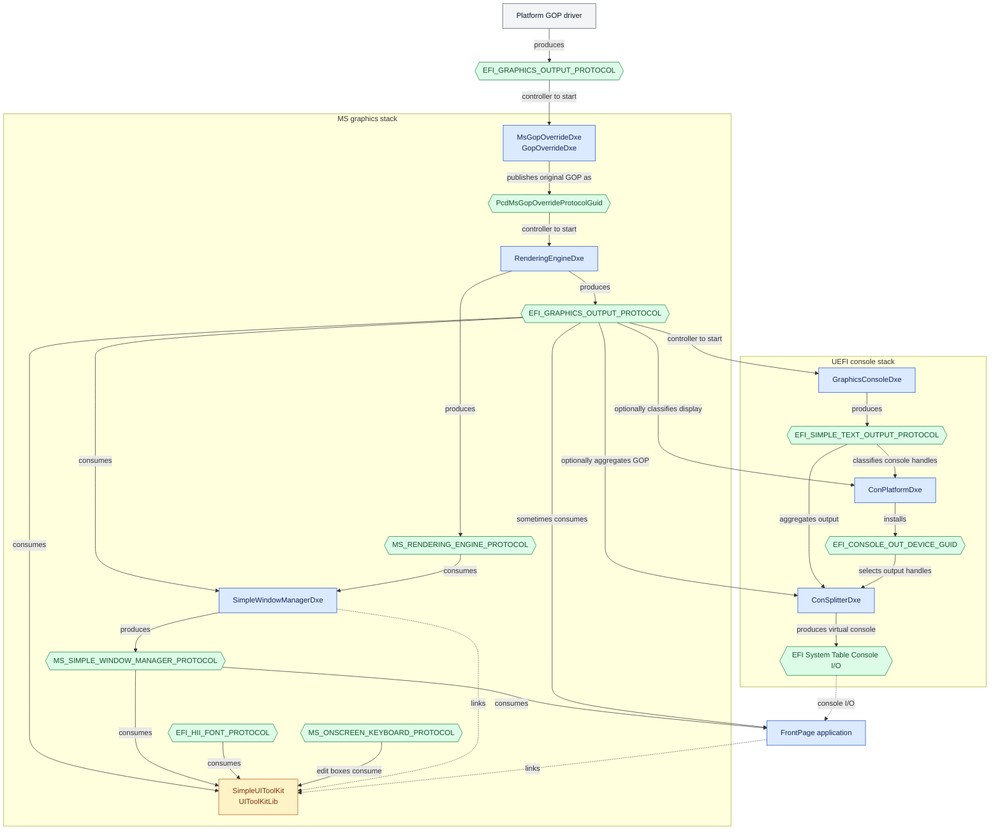

# MS Graphics Package

## About

This package has shared drivers and libraries that extend the UEFI graphics with a simple windowing system.

## UEFI Driver Model Dependencies

The following graph shows the protocol-mediated dependencies between the graphics stack, the UEFI console drivers,
and FrontPage. `MsGopOverrideDxe` is named `GopOverrideDxe` in this source tree. Solid arrows show protocols consumed
through the UEFI driver model; dashed arrows show linked library use and console I/O exposed through the EFI System
Table.

## Copyright

Copyright (C) Microsoft Corporation. All rights reserved.
SPDX-License-Identifier: BSD-2-Clause-Patent
